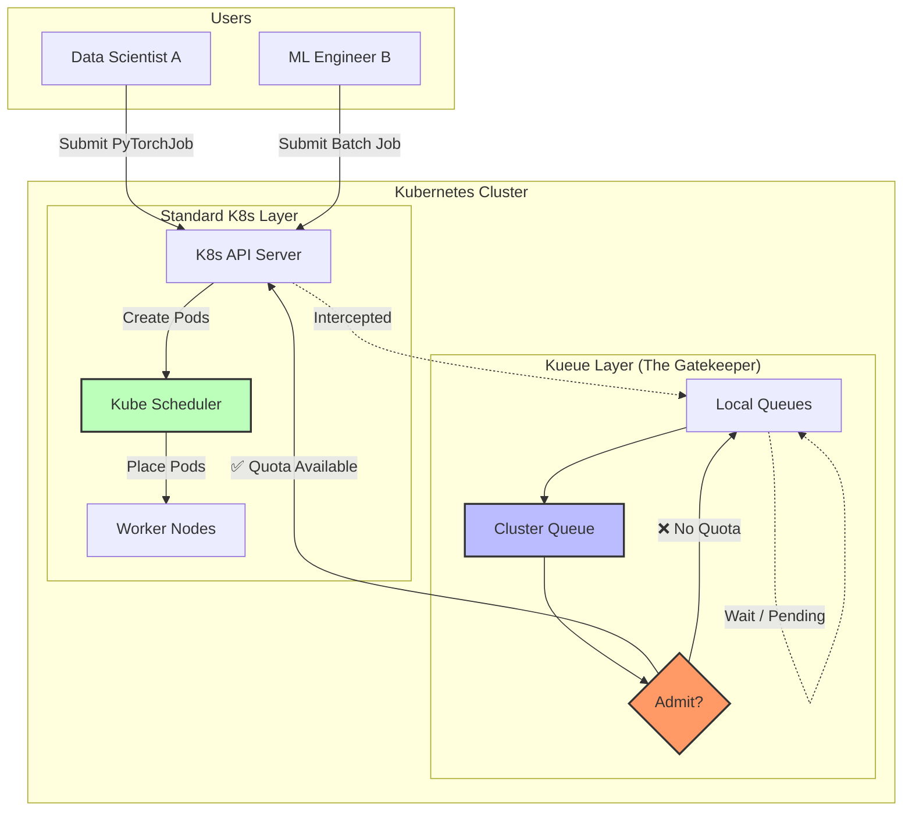
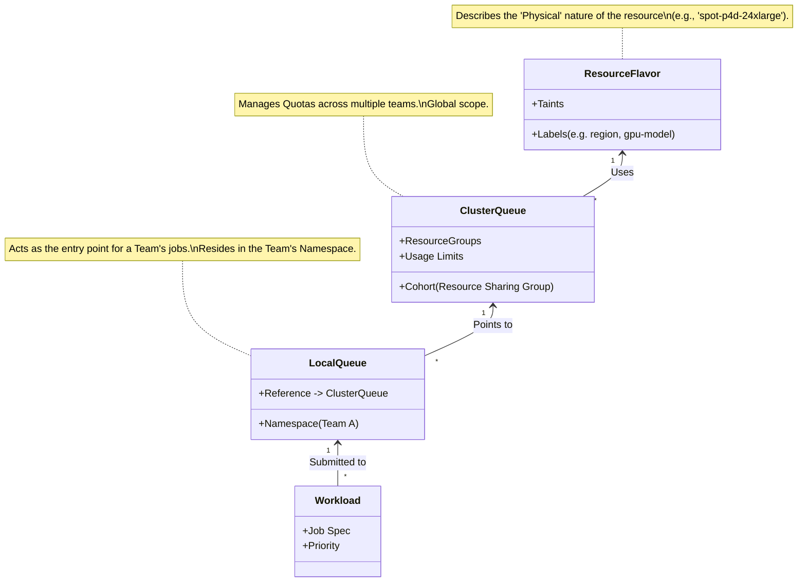
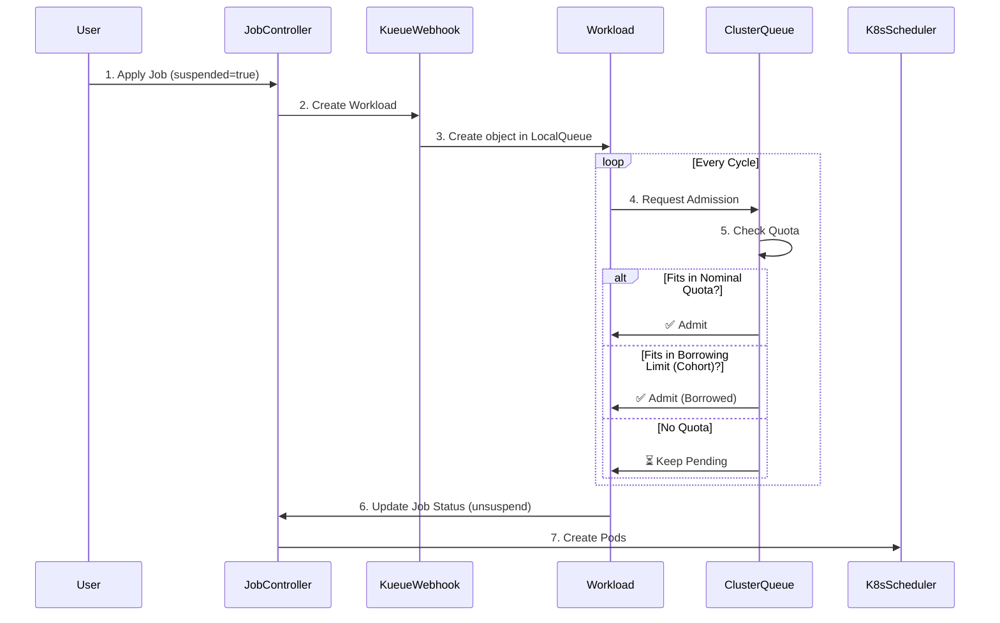
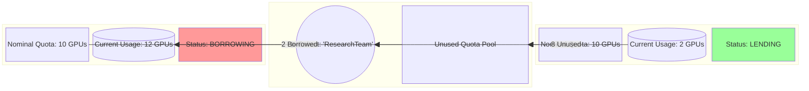

# Kueue: Kubernetes-Native Job Queueing

This document explains how **Kueue** works, moving from a high-level architectural view to low-level parameters and functionality.

## 1. High-Level Architecture: The "Traffic Controller" for Batch Jobs

Kueue acts as a gatekeeper for your Kubernetes cluster. Standard Kubernetes schedulers schedule *Pods* as soon as they are created. Kueue manages *Jobs* (collections of Pods) and decides **when** they should start, ensuring you don't overshoot your quotas or overload the cluster.



### Key Takeaways
*   **Users** submit standard K8s Jobs (e.g., `Job`, `MPIJob`, `RayJob`).
*   **Kueue** suspends them immediately (they don't create Pods yet).
*   **Kueue** only "admits" (unsuspends) the Job when the **ClusterQueue** has enough quota.

---

## 2. Core Concepts & Hierarchy

Kueue separates the *submission* of jobs (namespaced) from the *allocation* of resources (cluster-wide).



### The Objects
1.  **ResourceFlavor**: Describes *what* the resource is (e.g., "Spot Instance", "NVIDIA A100"). It doesn't define quantity, just the "flavor".
2.  **ClusterQueue**: Defines *how much* of a Flavor exists and *who* can use it. It is the central engine for quotas.
3.  **LocalQueue**: A namespaced pointer to a ClusterQueue. Users submit to this.
4.  **Workload**: The internal representation of a Job inside Kueue.

---

## 3. Low-Level Flow: Admission & Parameters

How does Kueue decide to run a job? It uses a complex calculation involving **Nominal Quotas**, **Borrowing**, and **Cohorts**.

### The Admission Loop



### Critical Parameters Visualization

Imagine a **Cohort** named `ResearchTeam` shared by two ClusterQueues: `TeamA` and `TeamB`.



### Parameter Explanations

| Parameter | Location | Description |
| :--- | :--- | :--- |
| **`nominalQuota`** | `ClusterQueue` | The guaranteed baseline resources for this queue. The queue can always use up to this amount. |
| **`borrowingLimit`** | `ClusterQueue` | How much *extra* the queue can take from the Cohort if others aren't using it. If `0`, it can never exceed `nominalQuota`. |
| **`cohort`** | `ClusterQueue` | A string identifier. All ClusterQueues with the same `cohort` name share their unused `nominalQuota` with each other. |
| **`reclaimWithinCohort`** | `ClusterQueue` | If `Any`, a queue can preempt (kill) jobs in other queues in the same cohort if it needs its `nominalQuota` back. |
| **`preemption`** | `ClusterQueue` | Controls logic for killing lower priority jobs to make room for higher priority ones (within the same queue or across the cluster). |

### Example Config Snippet
```yaml
apiVersion: kueue.x-k8s.io/v1beta1
kind: ClusterQueue
metadata:
  name: team-a-cq
spec:
  namespaceSelector: {} # Matches all namespaces
  cohort: "research-pool" # Joins the shared pool
  resourceGroups:
  - coveredResources: ["cpu", "memory", "nvidia.com/gpu"]
    flavors:
    - name: "on-demand"
      resources:
      - name: "nvidia.com/gpu"
        nominalQuota: 10    # Guaranteed 10 GPUs
        borrowingLimit: 5   # Can borrow up to 5 more (Total 15 max)
```
